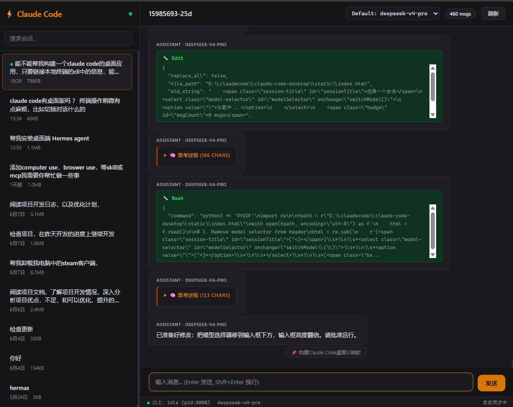

# Claude Code WebUI

<p align="center">
  
</p>

Browser-based companion UI for [Claude Code](https://claude.ai/code) CLI. View conversations, switch models, send messages, and approve prompts — all from your browser. The terminal stays as-is; the Web UI mirrors everything in real time.

## Features

- **Session browser** — list all past conversations across projects, search, one-click switch
- **Live chat view** — user/assistant messages, thinking blocks, tool calls all rendered
- **Real-time sync** — polls file changes (zero flicker), auto-detects active CLI session
- **Send messages** — type in the browser, sent to Claude Code via managed PTY process
- **Model switcher** — change `ANTHROPIC_MODEL` from the UI, applies on next CLI start
- **Prompt mirroring** — permission approvals, confirmations, choices, and text prompts all appear in the Web UI with approve/deny/input buttons
- **PTY-managed CLI** — optional managed Claude Code process with full terminal streaming via WebSocket

## Quick Start

### Prerequisites
- Python 3.10+
- [Claude Code CLI](https://docs.anthropic.com/en/docs/claude-code) installed (`npm install -g @anthropic-ai/claude-code`)

### Launch

**Option A — Desktop shortcut (Windows)**
Double-click `Claude Code Desktop.bat` on your desktop.

**Option B — Terminal**
```bash
cd claude-code-desktop
pip install fastapi uvicorn pydantic websockets pywinpty
python app.py
# Open http://127.0.0.1:9020
```

### Usage
1. Select a session from the left sidebar
2. Click **Start CLI** in the top bar to spawn a managed Claude Code process
3. Type messages in the input box, see responses in real time
4. When Claude Code asks for permission or confirmation, the prompt bar appears — click Approve/Deny or type your response

## Architecture

```
Browser (Web UI)  ←HTTP/WS→  Python FastAPI  ←PTY→  Claude Code CLI
                             (file watcher)  →  ~/.claude/ (JSONL sessions)
```

- **Backend:** Python FastAPI reads Claude Code's local data files (`~/.claude/projects/*.jsonl`, `sessions/*.json`, `settings.json`)
- **Managed CLI:** `winpty` (Windows ConPTY) spawns Claude Code as a real terminal process; stdout/stderr streamed via WebSocket; stdin sent from browser
- **Frontend:** Single-page HTML with vanilla JS, dark theme, responsive layout

## Endpoints

| Endpoint | Description |
|----------|-------------|
| `GET /api/sessions` | List all sessions |
| `GET /api/sessions/{id}` | Get conversation messages |
| `GET /api/active` | Current active CLI session |
| `GET /api/settings` | Current model config |
| `POST /api/settings/model` | Switch model |
| `POST /api/sessions/{id}/send` | Send message via `claude -p` |
| `GET /api/poll` | Health check + file size tracking |
| `WS /ws` | Real-time CLI output streaming |
| `POST /api/managed/action` | Start/stop/input to managed CLI |

## Files

```
claude-code-desktop/
├── app.py              # FastAPI backend
├── static/index.html   # Web UI (single page)
├── launch.bat          # Windows one-click launcher
├── requirements.txt
└── screenshot.png
```

## License

MIT
